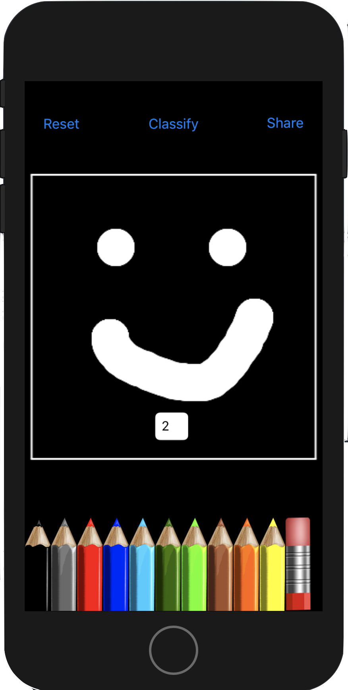

# SculptML iOS App

This repo contains the code necessary to compile the iOS app to run on your iPhone or iPad. The only information you must supply is the url of the server you are running the `SculptML Flask App` on. You must put in the url of your server, along with the port you are hosting it on, in the `server_url` in the following 2 files: `GraphBuilderViewController.swift` and `ModelsViewController.swift`. 

## Overview

The app is designed to make the model-building process as simple as possible. This app was created because we believed that experimenting with deep learning architectures should not be limited to only those who know how to code. Deep learning is experimental field, and I wanted to explore the possibility to making a tool that could produce professional-grade models on the fly for especially curious non-coders. There's still a lot of work to be done before this becomes a professional-grade tool, and automating setup & server hosting. However, we have demonstrated that such an educational tool can easily be built for the mobile experience.

## What Does This Do?

This app provides a click-and-swipe model-building screen that helps you to assemble a deep learning architecture from Keras-level layer abstractions. Once you have a complete model, you can send the model to a server you specified in the above files, and receive the trained model (< 15 minutes later). You can test your downloaded models by drawing numbers on a notepad (MNIST only).

#### Main Screen

As you build your model, we monitor the shapes of your intermediary layers in the `GraphBuilderViewController` and put a red box around layers which have invalid parameters. You may also select between two datasets, `MNIST` and `Iris`, which have require you to adjust the Input Layer shape to (28, 28, 1) or (0, 0, 4) respectively, and have a final layer shape of (0, 0, 10) or (0, 0, 3).

We also provide a short text description of your model on the right. This particular example shows that the current model is called 'cnnmodel', and has 5 layers ending in a `Dense` layer with an output shape of `(0, 0, 10)`. 
Below this description is a `UIPicker` element that lets you choose between the MNIST and Iris dataset. Currently its set to the MNIST dataset.
The bottom button lets you send your model for training on the server.

To assemble a model, click on layers from the `Layers` tab, which will appear at the bottom of the current model. To delete layers, swipe right on them. To adjust parameters of layers, just click on them.

#### Models Screen
Once you have successfully uploaded a model, about 15 minutes later, you can move over to the `Models` screen, and pull down on the top part of the screen. This will request to download your compiled trained model from the server.

Once you have a downloaded model, you can click on it to test it out (MNIST models only). We let you test out the models by either drawing a number on a Notepad, taking a picture with your camera, or uploading an image from your camera roll.

For example, if we choose Notepad, we can actually experiment with drawing numbers, and classifying them using the custom model you built and trained on the MNIST dataset! You can select colors by clicking on the pencils below, and reset the drawing by hitting the Reset button in the top left. Clicking the Classify button will use the square portion of the image on your model for classification, and will display its result in the white text box.

While it's fun to test on normal pictures that are a in the dataset's distribution, it's also fun to test some funny things :)

	
Enjoy!

# Contributions

Big shoutout to colead Felipe Campos, and iOS team Alex Chan and Sai Mandava. On the overall SculptML project, thank you to the backend team: Newman Hu, Allen Chen, Candance Chiang, and Riley Shanahan.

# Future Work

We started this project with an additional desire to include shared augmented reality visualizations of the deep learning architectures you build and train for educational purposes. However, it quickly became apparent that this would become a large technical project in and of itself. So, we leave that task to a future endeavor.
